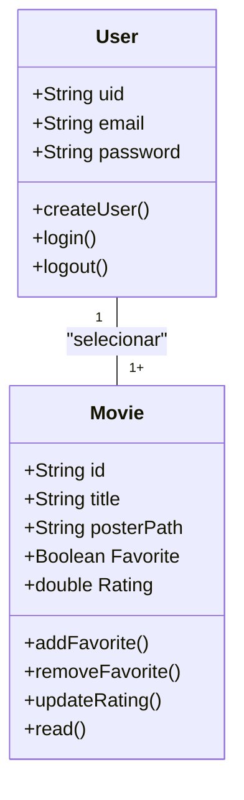

# CineFavorite - Formativa
Construindo um aplicativo do Zero - O CineFavorite permitirá criar uma conta e buscar filmes em uma api e montar uma galeria pessoal de filmes favoritos, com capas e notas.

## Objetivos
- Integrar o Aplicativo a uam API
- Criar uma conta pessoal no FireBase
- Armazenar informações para Cada usuários das preferencias solicitadas
- consultar informações de Filmes (Capas, Título)

## Levantamentos de Requisitos

- Funcionais

- Não Funcionais

## Diagramas

1. ### Diagrama de Classe
    Diagrama de que demonstra as entidades da aplicação

    - usuário (user) : classe criada pelo FireBase
        - email
        - senha
        - id
        - create()
        - login()
        - logout()

    - Filme (Movie) : Classe modelada pelo dev
        - number id:
        - String titulo:
        - String PosterPath
        - boolean favorito
        - double Nota
        - adicionar()
        - update()
        - remover()
        - listarFavoritos()

2. ### Diagrama de uso

3. ### Diagrama de Fluxo

## Prototipagem
- https://www.figma.com/design/E8aNET81uq5MdkpZYOap9k/Untitled?node-id=1-2&m=dev&t=KACHXyiVQuOvIGJv-1

## Codificação